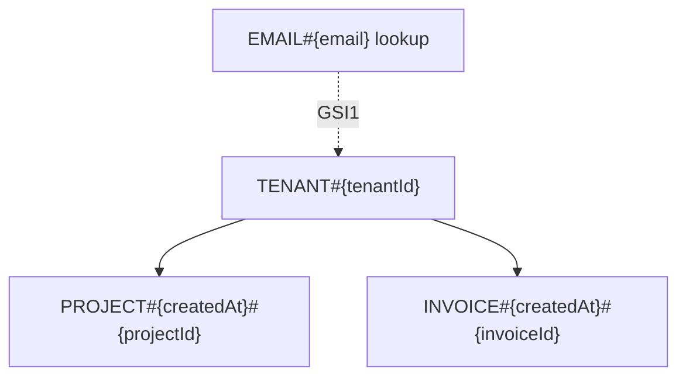

# Schema Reference Pattern

Use this reference when a task creates or materially changes a concrete DynamoDB schema.

## Goal

Keep a durable human-readable description of the live DynamoDB design in `docs/schema-reference.md`.

This document should make it easy for another engineer to understand:

- what the access patterns are
- how keys are shaped
- what item types exist
- what each index is for
- how pagination, uniqueness, and TTL work
- how the item families relate visually

## When to update

Generate or update `docs/schema-reference.md` when the task:

- adds a new entity or item family
- changes PK or SK templates
- adds, removes, or repurposes a GSI
- changes pagination behavior
- adds uniqueness records or lookup records
- introduces TTL-based expiry
- changes tenant partitioning or other major table layout decisions

Do not require this document for early brainstorming where no concrete schema has been chosen yet.

## Default location

Use:

```text
docs/schema-reference.md
```

If the repository uses another docs folder, match the existing convention.

## Recommended structure

Use concise sections in this order:

```markdown
# DynamoDB Schema Reference

## Table Strategy
## Diagram
## Access Patterns
## Primary Key Design
## Global Secondary Indexes
## Item Families
## Pagination
## Uniqueness and Lookup Records
## TTL and Expiry
## Operational Notes
```

Only include sections that have content.

## Section guidance

### Table Strategy

State:

- single-table, multi-table, or mixed
- why that choice was made
- whether tenant partitioning or another dominant partitioning strategy is in use

### Diagram

Include a Mermaid diagram near the top of the document.

Prefer a diagram that helps a reader quickly understand:

- the dominant partitioning approach
- the main item families
- important relationships between entities
- lookup or uniqueness helper records when they matter
- which GSIs support important alternate access paths

Use a simple Mermaid flowchart or ER-style diagram. Favor clarity over completeness.

Example:

````markdown
## Diagram


````

### Access Patterns

List the named reads and writes the schema is designed to support.

For each one, include:

- operation name
- key or index used
- expected sort order
- notable constraints

### Primary Key Design

Document the main PK/SK templates explicitly.

Example:

```text
PK = TENANT#{tenantId}
SK = PROJECT#{createdAt}#{projectId}
```

### Global Secondary Indexes

For each GSI, include:

- index name
- key template
- which access patterns it serves
- whether it is sparse or overloaded

### Item Families

Describe the logical item types stored in the table and what each represents.

Example:

- tenant metadata
- project item
- invoice item
- uniqueness record
- lookup record

### Pagination

Document:

- which queries are paginated
- whether cursors are based on `LastEvaluatedKey`
- any important cursor constraints

### Uniqueness and Lookup Records

Document any helper records used for:

- uniqueness guarantees
- alternate lookups
- direct lookup by ID when the main sort key is optimized for ordering

### TTL and Expiry

Document:

- which items expire
- which attribute is used for TTL
- any application-side validation rules needed because TTL deletion is not immediate

### Operational Notes

Capture high-signal caveats only, such as:

- hot partition risk
- large tenant risk
- large item risk
- overloaded GSI tradeoffs
- analytics limitations

## Writing style

- prefer templates and examples over long prose
- keep the document easy to scan
- update the existing file in place rather than rewriting unrelated sections
- match what the live code actually does, not what the design might become later
- keep Mermaid diagrams compact and readable in plain Markdown
